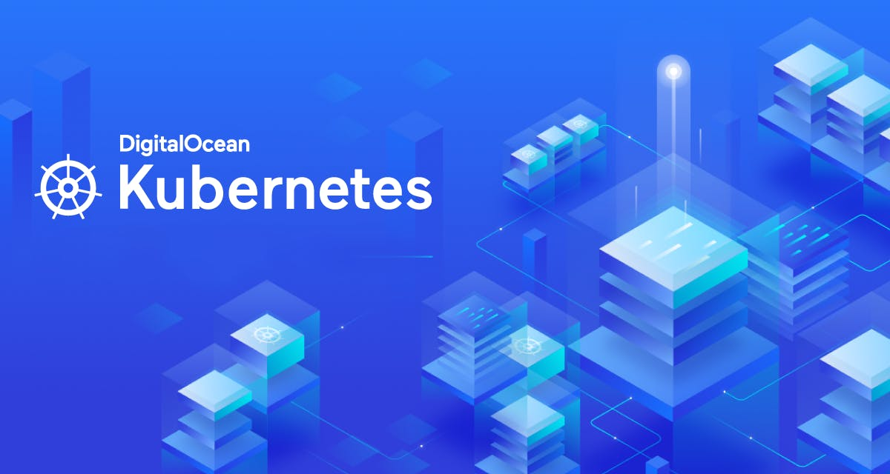

# 🌊 **Creating Your First Kubernetes Cluster on DigitalOcean with Terraform** 🚀




Welcome to the world of Kubernetes and Terraform! In this guide, we'll walk you through the process of creating your very first Kubernetes cluster on **DigitalOcean** using **Terraform**. Whether you're a seasoned developer or just starting out, this guide will help you get up and running in no time.

## 🎁 **Why DigitalOcean?**

DigitalOcean is a cloud provider that offers a simple and developer-friendly platform to deploy and manage your applications. With its **Kubernetes-as-a-Service** offering, you can easily spin up a managed Kubernetes cluster without the hassle of managing the control plane.

### 💸 **It's (Almost) Free!**

If you're a **GitHub Student** or have access to the **GitHub Student Developer Pack**, you can get **$100 in credits** from DigitalOcean. Even if you're not a student, DigitalOcean often provides **free credits** for new users. So, why not take advantage of this and start your Kubernetes journey without breaking the bank?

## 🛠️ **What You'll Need**

Before we dive in, make sure you have the following:

1. **A DigitalOcean Account**: If you don't have one, sign up [here](https://cloud.digitalocean.com/registrations/new).
2. **A DigitalOcean API Token**: You can generate one from the [API section](https://cloud.digitalocean.com/account/api/tokens) of your DigitalOcean dashboard.
3. **Terraform Installed**: Download and install Terraform from [here](https://www.terraform.io/downloads.html).
4. **kubectl Installed**: This is the Kubernetes command-line tool. You can install it by following the [official guide](https://kubernetes.io/docs/tasks/tools/install-kubectl/).

## 🚀 **Let's Get Started!**

### 1. **Set Up Your Terraform Configuration**

First, create a directory for your Terraform project:

```bash
mkdir digitalocean-k8s
cd digitalocean-k8s
```

Now, create the following files:

#### **`provider.tf`**

This file configures the DigitalOcean provider for Terraform.

```hcl
provider "digitalocean" {
  token = var.do_token
}
```

#### **`variables.tf`**

This file defines the variables we'll use in our configuration.

```hcl
variable "do_token" {
  description = "Your DigitalOcean API token"
  type        = string
}

variable "cluster_name" {
  description = "The name of the Kubernetes cluster"
  type        = string
  default     = "my-k8s-cluster"
}

variable "region" {
  description = "The region where the Kubernetes cluster will be created"
  type        = string
  default     = "nyc1"
}

variable "node_size" {
  description = "The size of the nodes in the Kubernetes cluster"
  type        = string
  default     = "s-2vcpu-2gb"
}

variable "node_count" {
  description = "The number of nodes in the Kubernetes cluster"
  type        = number
  default     = 2
}
```

#### **`main.tf`**

This file defines the Kubernetes cluster resource.

```hcl
resource "digitalocean_kubernetes_cluster" "k8s_cluster" {
  name    = var.cluster_name
  region  = var.region
  version = "latest"

  node_pool {
    name       = "default-pool"
    size       = var.node_size
    node_count = var.node_count
  }
}
```

#### **`outputs.tf`**

This file will output useful information after the cluster is created.

```hcl
output "kubeconfig" {
  description = "Kubeconfig file for the created cluster"
  value       = digitalocean_kubernetes_cluster.k8s_cluster.kube_config.0.raw_config
  sensitive   = true
}

output "cluster_id" {
  description = "The ID of the created Kubernetes cluster"
  value       = digitalocean_kubernetes_cluster.k8s_cluster.id
}
```

### 2. **Initialize Terraform**

Run the following command to initialize Terraform and download the necessary providers:

```bash
terraform init
```

### 3. **Apply the Configuration**

Now, it's time to create your Kubernetes cluster! Run the following command:

```bash
terraform apply
```

Terraform will prompt you to enter your DigitalOcean API token. If you prefer, you can set it as an environment variable:

```bash
export TF_VAR_do_token="your_digitalocean_api_token"
terraform apply
```

Terraform will show you a plan of the resources it will create. Type `yes` to confirm and create the cluster.

### 4. **Access Your Cluster**

Once the cluster is created, Terraform will output the `kubeconfig` file. You can use this file to configure `kubectl` and access your cluster:

```bash
echo "$(terraform output kubeconfig)" > kubeconfig.yaml
export KUBECONFIG=./kubeconfig.yaml
kubectl get nodes
```

You should see your Kubernetes nodes up and running! 🎉

### 5. **Clean Up (Optional)**

If you want to delete the cluster and all associated resources, run:

```bash
terraform destroy
```

## 🎉 **Congratulations!**

You've successfully created your first Kubernetes cluster on DigitalOcean using Terraform! Now you're ready to deploy your applications and explore the power of Kubernetes.

### 📚 **Next Steps**

- **Deploy an Application**: Try deploying a simple application using `kubectl` or Helm.
- **Explore DigitalOcean's Managed Databases**: Combine your Kubernetes cluster with a managed database for a full-stack application.
- **Automate with CI/CD**: Set up a CI/CD pipeline to automate your deployments.

Happy coding! 🚀

---

**Note**: Remember to monitor your DigitalOcean usage to avoid unexpected charges. If you're using free credits, make sure to stay within the limits.

If you have any questions or run into issues, feel free to reach out to the [DigitalOcean Community](https://www.digitalocean.com/community) or check out the [Terraform documentation](https://www.terraform.io/docs/index.html).

Enjoy your Kubernetes journey! 🌊

#### Connect to Your Cluster 
> If you want to connect directly to your kubernetes cluster, you can use the guide at [access.md](access.md)

### Socials
+ GitHub: [github.com/alexrivasmachin](github.com/alexrivasmachin)
+ LinkedIn: [www.linkedin.com/in/alex-rivas-machin](www.linkedin.com/in/alex-rivas-machin)
+ Portfolio: [alexrivasmachin.eus](alexrivasmachin.eus)